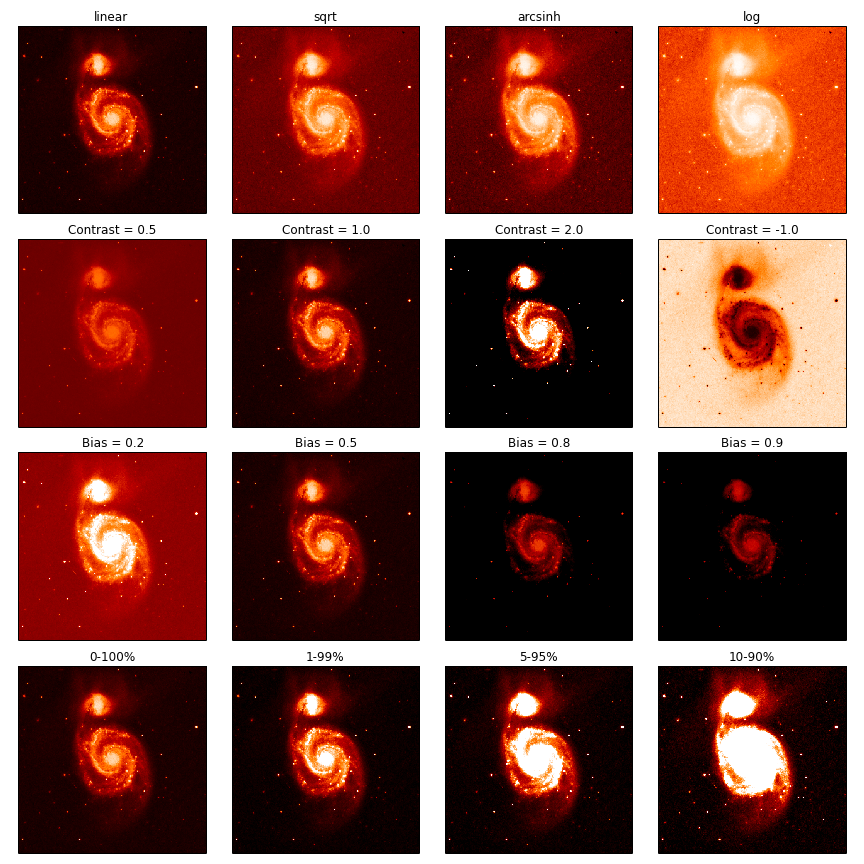

ds9norm
=======

This file implements a matplotlib Normalize object
which mimics the functionality of image scaling functions in [ds9](http://ds9.si.edu/site/Home.html). It provides 5 ways of configuring image scaling:

  - Clipping the low and high intensities at specified percentiles (`clip_lo`, `clip_hi`)
  - Specifying an intensity transfer function for ramping from black to white
    (`stretch`)
  - Setting the mid-point of this transfer function (`bias`, akin to dragging
    the right mouse button left/right in ds9)
  - Setting how sharp the transition from black-white is (`contrast`, akin
    to draggin the mouse button up/down in ds9)

Examples
--------

See the [example notebook]()

```python

data = fits.getdata('M51.fits')
norm = DS9Normalize(bias=0.2)
figure, axs = plt.subplots(ncols=3, nrows=3, squeeze=False, tight_layout=True)

for ax, bias in zip(axs[2], [.2, .5, .8]):
    ax.imshow(data, norm=DS9Normalize(bias=bias))
    ax.set_title('Bias = %0.1f' % bias)

for ax, contrast in zip(axs[1], [0.5, 1, 2]):
    ax.imshow(data, norm=DS9Normalize(contrast=contrast))
    ax.set_title('Contrast = %0.1f' % contrast)

for ax, stretch in zip(axs[0], ['linear', 'sqrt', 'arcsinh']):
    ax.imshow(data, norm=DS9Normalize(stretch=stretch))
    ax.set_title(stretch)
```


